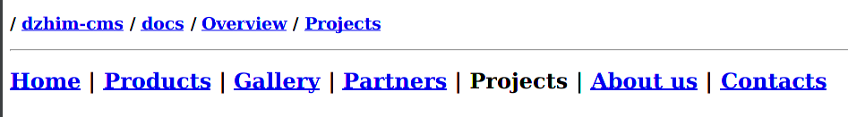

## [mdpr](https://github.com/janis-rullis/shell-scripts/blob/master/mdpr.sh)

Preview MarkDown files from terminal using ReText.

> Ctrl + E - Switch the Preview / Edit mode.

##  [md-nav-gen](https://github.com/janis-rullis/shell-scripts/tree/master/md-nav-gen)

Generate a navigation bar, like this.

```md
-----------------------------------------------------------------------------------

### / [shell-scripts](../) / [md-nav-gen](.)

-----------------------------------------------------------------------------------
```

## [md-ls-gen](https://github.com/janis-rullis/shell-scripts/tree/master/md-ls-gen)

Generate links to files inside this directory.

```md
* [docs](./docs)
* [how-to](./docs/how-to)
```

## [md-tree-gen](https://github.com/janis-rullis/shell-scripts/tree/master/md-tree-gen)

Generate links to files inside this directory and below.

```markdown
 * [docs](./docs)
   * [how-to](./docs/how-to)
   * [serve.md](./docs/how-to/serve.md)
 * [Tree.md](./Tree.md)
 * [README.md](./README.md)
 * [md-tree-gen.sh](./md-tree-gen.sh)
```

## Sample of links formated like a header menu

```md
## [Home](Home/) | [Products](Products/) | [Gallery](Gallery/) | [Partners](Partners/) | Projects | [About us](About-us/) | [Contacts](Contacts/)
```



## Random tips

### Images

* I've found that the perfect size for an image in Markdown docs, is when one of
 the dimensions (width or height) is `250-300px`. [Example](https://github.com/janis-rullis/construction/blob/master/Door-locks.md).
